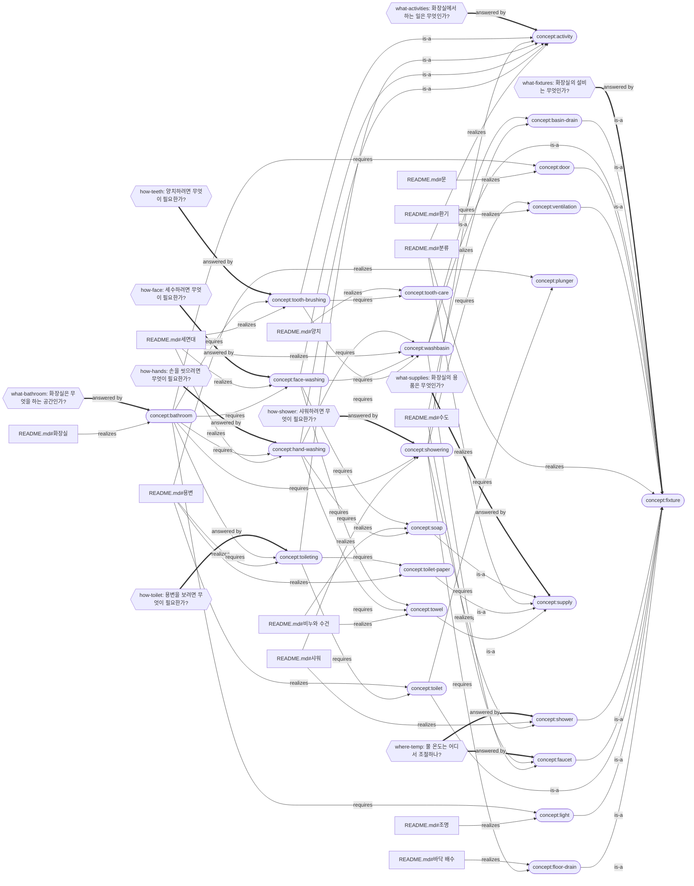

# bathroom — the net

Rendered from `mangsang/` by mangsang 1.8.1; the record is the source, this page is not. 23 concept(s), 86 relation(s), 15 question(s), 5 source(s).

Rounded nodes are concepts, hexagons are questions (OPEN: nothing answers it yet); a dotted edge is a relation whose end moved since it was confirmed. Sources are not drawn; each concept lists the words that ground it below.

## Concepts

### activity

> 화장실에서 하는 일: 손 씻기, 세수, 양치, 용변, 샤워.

declared by guineeeeeeeeeeeeeeeeeeeeeeeerm (approved in `source:bath-03`, answering the agent's `source:bath-p2`)

- `source:bath-02` realizes — fresh · delegated: the agent tied each concept to the kind the owner named in bath-03 (and the a… · “(가)로 가자.”
- `README.md#분류` realizes — fresh · delegated: the agent tied each concept to the kind the owner named in bath-03 (and the a… · “하는 일: 손 씻기, 세수, 양치, 용변, 샤워”
- `concept:hand-washing` is-a — fresh · delegated: the agent tied each concept to the kind the owner named in bath-03 (and the a… · “손 씻기”
- `concept:face-washing` is-a — fresh · delegated: the agent tied each concept to the kind the owner named in bath-03 (and the a… · “세수”
- `concept:toileting` is-a — fresh · delegated: the agent tied each concept to the kind the owner named in bath-03 (and the a… · “용변”
- `concept:showering` is-a — fresh · delegated: the agent tied each concept to the kind the owner named in bath-03 (and the a… · “샤워.”
- `concept:tooth-brushing` is-a — fresh · delegated: the agent tied each concept to the kind the owner named in bath-03 (and the a… · “양치”

### basin-drain

> 물이 흘러가야 하므로 수도관이 세면대 바닥에 연결되어 있어야 하고, 물을 받아놓고 싶을 수 있으니 물을 막을 방법도 있어야해.

declared by guineeeeeeeeeeeeeeeeeeeeeeeerm (approved in `source:bath-02`, answering the agent's `source:bath-p1`)

- `README.md#수도` realizes — fresh · delegated: the agent tied the owner's sentences to the concepts they state, quoting each… · “물을 막을 방법도 있어야해.”
- `concept:washbasin` requires — fresh · delegated: the agent tied the owner's sentences to the concepts they state, quoting each… · “수도관이 세면대 바닥에 연결되어 있어야”
- `source:bath-01` realizes — fresh · delegated: the agent tied the owner's sentences to the concepts they state, quoting each… · “물이 흘러가야 하므로 수도관이 세면대 바닥에 연결되어 있어야 하고”
- `concept:fixture` is-a — fresh · delegated: the agent tied each concept to the kind the owner named in bath-03 (and the a… · “세면대 배수”

### bathroom

> 세면대에서 손을 씻고 세수하고 양치하며, 대변과 소변을 보고, 샤워를 하는 공간. 들어가고 나갈 수 있어야 하고 빛이 있어야 한다.

declared delegated: the agent's summary of bath-01 — the explanation defines no single sentence f…

- `concept:face-washing` requires — fresh · delegated: the agent tied the owner's sentences to the concepts they state, quoting each… · “세수하고”
- `concept:showering` requires — fresh · delegated: the agent tied the owner's sentences to the concepts they state, quoting each… · “화장실에서 샤워를 하는 것도 가능해야해.”
- `concept:door` requires — fresh · delegated: the agent tied the owner's sentences to the concepts they state, quoting each… · “공간에 들어가고 나갈 수 있어야 하므로 문이 있어야해.”
- `concept:tooth-brushing` requires — fresh · delegated: the agent tied the owner's sentences to the concepts they state, quoting each… · “양치하며”
- `concept:toileting` requires — fresh · delegated: the agent tied the owner's sentences to the concepts they state, quoting each… · “화장실에서는 대변과 소변을 봐야해.”
- `concept:hand-washing` requires — fresh · delegated: the agent tied the owner's sentences to the concepts they state, quoting each… · “세면대에서 손을 씻고”
- `source:bath-01` realizes — fresh · delegated: the agent tied the owner's sentences to the concepts they state, quoting each… · “화장실 설명을 시작할게.”
- `README.md#화장실` realizes — fresh · delegated: the agent tied the owner's sentences to the concepts they state, quoting each… · “화장실에서 하는 일과 그 일에 필요한 것에 대한 설명이다.”
- `concept:light` requires — fresh · delegated: the agent tied the owner's sentences to the concepts they state, quoting each… · “빛이 있어야 하므로 전등이 있어야해.”

### door

> 공간에 들어가고 나갈 수 있어야 하므로 문이 있어야해.

declared by guineeeeeeeeeeeeeeeeeeeeeeeerm (approved in `source:bath-02`, answering the agent's `source:bath-p1`)

- `README.md#문` realizes — fresh · delegated: the section gained a trailing blank line when 분류 was appended after it; the q… · re-confirmed 1 time(s) · “공간에 들어가고 나갈 수 있어야 하므로 문이 있어야해.”
- `concept:bathroom` requires — fresh · delegated: the agent tied the owner's sentences to the concepts they state, quoting each… · “공간에 들어가고 나갈 수 있어야 하므로 문이 있어야해.”
- `source:bath-01` realizes — fresh · delegated: the agent tied the owner's sentences to the concepts they state, quoting each… · “공간에 들어가고 나갈 수 있어야 하므로 문이 있어야해.”
- `concept:fixture` is-a — fresh · delegated: the agent tied each concept to the kind the owner named in bath-03 (and the a… · “문.”

### face-washing

> 세면대에서 세수를 하는 일. 세수를 하기 위해서는 세면용 비누가 있어야 하고, 씻고 나면 물을 말려야 하므로 수건이 있어야 한다.

declared by guineeeeeeeeeeeeeeeeeeeeeeeerm (approved in `source:bath-02`, answering the agent's `source:bath-p1`)

- `concept:bathroom` requires — fresh · delegated: the agent tied the owner's sentences to the concepts they state, quoting each… · “세수하고”
- `concept:washbasin` requires — fresh · delegated: the agent tied the owner's sentences to the concepts they state, quoting each… · “세수를 하고”
- `README.md#세면대` realizes — fresh · delegated: the agent tied the owner's sentences to the concepts they state, quoting each… · “세수를 하고”
- `source:bath-01` realizes — fresh · delegated: the agent tied the owner's sentences to the concepts they state, quoting each… · “세수를 하기 위해서는 세면용 비누가 있어야 하므로”
- `concept:activity` is-a — fresh · delegated: the agent tied each concept to the kind the owner named in bath-03 (and the a… · “세수”
- `concept:soap` requires — fresh · delegated: the agent tied the owner's sentences to the concepts they state, quoting each… · “세수를 하기 위해서는 세면용 비누가 있어야”
- `concept:towel` requires — fresh · delegated: the agent tied the owner's sentences to the concepts they state, quoting each… · “씻고 나면 물을 말려야 하므로 수건이 있어야”

### faucet

> 세면대에는 물이 나와야 하므로 수도꼭지가 있어야해. 물 온도를 조절할 수 있어야 하고.

declared by guineeeeeeeeeeeeeeeeeeeeeeeerm (approved in `source:bath-02`, answering the agent's `source:bath-p1`)

- `source:bath-01` realizes — fresh · delegated: the agent tied the owner's sentences to the concepts they state, quoting each… · “세면대에는 물이 나와야 하므로 수도꼭지가 있어야해.”
- `concept:washbasin` requires — fresh · delegated: the agent tied the owner's sentences to the concepts they state, quoting each… · “세면대에는 물이 나와야 하므로 수도꼭지가 있어야해.”
- `concept:fixture` is-a — fresh · delegated: the agent tied each concept to the kind the owner named in bath-03 (and the a… · “수도꼭지”
- `README.md#수도` realizes — fresh · delegated: the agent tied the owner's sentences to the concepts they state, quoting each… · “수도꼭지가 있어야해. 물 온도를 조절할 수 있어야 하고.”

### fixture

> 화장실에 설치된 설비: 세면대, 수도꼭지, 세면대 배수, 변기, 샤워기, 바닥 배수, 환기, 전등, 문. 환기는 설비로 해.

declared by guineeeeeeeeeeeeeeeeeeeeeeeerm (approved in `source:bath-03`, answering the agent's `source:bath-p2`)

- `concept:floor-drain` is-a — fresh · delegated: the agent tied each concept to the kind the owner named in bath-03 (and the a… · “바닥 배수”
- `concept:light` is-a — fresh · delegated: the agent tied each concept to the kind the owner named in bath-03 (and the a… · “전등”
- `source:bath-03` realizes — fresh · delegated: the agent tied each concept to the kind the owner named in bath-03 (and the a… · “환기는 설비로 해”
- `concept:toilet` is-a — fresh · delegated: the agent tied each concept to the kind the owner named in bath-03 (and the a… · “변기”
- `concept:faucet` is-a — fresh · delegated: the agent tied each concept to the kind the owner named in bath-03 (and the a… · “수도꼭지”
- `concept:shower` is-a — fresh · delegated: the agent tied each concept to the kind the owner named in bath-03 (and the a… · “샤워기”
- `README.md#분류` realizes — fresh · delegated: the agent tied each concept to the kind the owner named in bath-03 (and the a… · “설비: 세면대, 수도꼭지, 세면대 배수, 변기, 샤워기, 바닥 배수, 환기, 전등, 문”
- `concept:ventilation` is-a — fresh · delegated: the agent tied each concept to the kind the owner named in bath-03 (and the a… · “환기는 설비로 해.”
- `concept:door` is-a — fresh · delegated: the agent tied each concept to the kind the owner named in bath-03 (and the a… · “문.”
- `concept:washbasin` is-a — fresh · delegated: the agent tied each concept to the kind the owner named in bath-03 (and the a… · “설비: 세면대”
- `concept:basin-drain` is-a — fresh · delegated: the agent tied each concept to the kind the owner named in bath-03 (and the a… · “세면대 배수”

### floor-drain

> 샤워기가 설치된 곳에는 물이 내려가야하므로 바닥에 하수관과 연결된 영역이 있어야해.

declared by guineeeeeeeeeeeeeeeeeeeeeeeerm (approved in `source:bath-02`, answering the agent's `source:bath-p1`)

- `concept:fixture` is-a — fresh · delegated: the agent tied each concept to the kind the owner named in bath-03 (and the a… · “바닥 배수”
- `source:bath-01` realizes — fresh · delegated: the agent tied the owner's sentences to the concepts they state, quoting each… · “샤워기가 설치된 곳에는 물이 내려가야하므로”
- `concept:showering` requires — fresh · delegated: the agent tied the owner's sentences to the concepts they state, quoting each… · “샤워기가 설치된 곳에는 물이 내려가야하므로”
- `README.md#바닥 배수` realizes — fresh · delegated: the agent tied the owner's sentences to the concepts they state, quoting each… · “바닥에 하수관과 연결된 영역이 있어야해.”

### hand-washing

> 세면대에서 손을 씻는 일. 손 씻을 때도 마찬가지 — 비누가 있어야 하고, 씻고 나면 물을 말려야 하므로 수건이 있어야 한다.

declared by guineeeeeeeeeeeeeeeeeeeeeeeerm (approved in `source:bath-02`, answering the agent's `source:bath-p1`)

- `concept:soap` requires — fresh · delegated: the agent tied the owner's sentences to the concepts they state, quoting each… · “손 씻을 때도 마찬가지.”
- `README.md#세면대` realizes — fresh · delegated: the agent tied the owner's sentences to the concepts they state, quoting each… · “여기서 손을 씻거나”
- `concept:activity` is-a — fresh · delegated: the agent tied each concept to the kind the owner named in bath-03 (and the a… · “손 씻기”
- `concept:towel` requires — fresh · delegated: the agent tied the owner's sentences to the concepts they state, quoting each… · “씻고 나면 물을 말려야 하므로 수건이 있어야”
- `source:bath-01` realizes — fresh · delegated: the agent tied the owner's sentences to the concepts they state, quoting each… · “손 씻을 때도 마찬가지.”
- `concept:bathroom` requires — fresh · delegated: the agent tied the owner's sentences to the concepts they state, quoting each… · “세면대에서 손을 씻고”
- `concept:washbasin` requires — fresh · delegated: the agent tied the owner's sentences to the concepts they state, quoting each… · “여기서 손을 씻거나”

### light

> 빛이 있어야 하므로 전등이 있어야해.

declared by guineeeeeeeeeeeeeeeeeeeeeeeerm (approved in `source:bath-02`, answering the agent's `source:bath-p1`)

- `concept:fixture` is-a — fresh · delegated: the agent tied each concept to the kind the owner named in bath-03 (and the a… · “전등”
- `README.md#조명` realizes — fresh · delegated: the agent tied the owner's sentences to the concepts they state, quoting each… · “빛이 있어야 하므로 전등이 있어야해.”
- `source:bath-01` realizes — fresh · delegated: the agent tied the owner's sentences to the concepts they state, quoting each… · “빛이 있어야 하므로 전등이 있어야해.”
- `concept:bathroom` requires — fresh · delegated: the agent tied the owner's sentences to the concepts they state, quoting each… · “빛이 있어야 하므로 전등이 있어야해.”

### plunger

> 변기가 막혔을 때 뚫기 위한 도구도 있어야해.

declared by guineeeeeeeeeeeeeeeeeeeeeeeerm (approved in `source:bath-02`, answering the agent's `source:bath-p1`)

- `source:bath-01` realizes — fresh · delegated: the agent tied the owner's sentences to the concepts they state, quoting each… · “변기가 막혔을 때 뚫기 위한 도구도 있어야해.”
- `concept:toilet` requires — fresh · delegated: the agent tied the owner's sentences to the concepts they state, quoting each… · “변기가 막혔을 때 뚫기 위한 도구도 있어야해.”
- `README.md#용변` realizes — fresh · delegated: the agent tied the owner's sentences to the concepts they state, quoting each… · “변기가 막혔을 때 뚫기 위한 도구도 있어야해.”

### shower

> 샤워기와 연결된 수도관이 있어야 하고, 세면대의 수도와 마찬가지로 온도 조절이 가능해야해.

declared by guineeeeeeeeeeeeeeeeeeeeeeeerm (approved in `source:bath-02`, answering the agent's `source:bath-p1`)

- `source:bath-01` realizes — fresh · delegated: the agent tied the owner's sentences to the concepts they state, quoting each… · “세면대의 수도와 마찬가지로 온도 조절이 가능해야해.”
- `concept:showering` requires — fresh · delegated: the agent tied the owner's sentences to the concepts they state, quoting each… · “샤워기와 연결된 수도관이 있어야”
- `concept:fixture` is-a — fresh · delegated: the agent tied each concept to the kind the owner named in bath-03 (and the a… · “샤워기”
- `README.md#샤워` realizes — fresh · delegated: the agent tied the owner's sentences to the concepts they state, quoting each… · “샤워기와 연결된 수도관이 있어야 하고”

### showering

> 화장실에서 샤워를 하는 것도 가능해야해. 샤워를 하고 나면 공간에 습기가 차기 때문에 환기가 필요하다.

declared by guineeeeeeeeeeeeeeeeeeeeeeeerm (approved in `source:bath-02`, answering the agent's `source:bath-p1`)

- `source:bath-01` realizes — fresh · delegated: the agent tied the owner's sentences to the concepts they state, quoting each… · “화장실에서 샤워를 하는 것도 가능해야해.”
- `README.md#샤워` realizes — fresh · delegated: the agent tied the owner's sentences to the concepts they state, quoting each… · “화장실에서 샤워를 하는 것도 가능해야해.”
- `concept:ventilation` requires — fresh · delegated: the agent tied the owner's sentences to the concepts they state, quoting each… · “샤워를 하고 나면 공간에 습기가 차기 때문에”
- `concept:bathroom` requires — fresh · delegated: the agent tied the owner's sentences to the concepts they state, quoting each… · “화장실에서 샤워를 하는 것도 가능해야해.”
- `concept:shower` requires — fresh · delegated: the agent tied the owner's sentences to the concepts they state, quoting each… · “샤워기와 연결된 수도관이 있어야”
- `concept:activity` is-a — fresh · delegated: the agent tied each concept to the kind the owner named in bath-03 (and the a… · “샤워.”
- `concept:floor-drain` requires — fresh · delegated: the agent tied the owner's sentences to the concepts they state, quoting each… · “샤워기가 설치된 곳에는 물이 내려가야하므로”

### soap

> 비누를 놓을수 있는 곳이 있어야해. 액체형일 수도 있고 고체형일 수도 있어. 손 씻을 때도 마찬가지.

declared by guineeeeeeeeeeeeeeeeeeeeeeeerm (approved in `source:bath-02`, answering the agent's `source:bath-p1`)

- `concept:hand-washing` requires — fresh · delegated: the agent tied the owner's sentences to the concepts they state, quoting each… · “손 씻을 때도 마찬가지.”
- `README.md#비누와 수건` realizes — fresh · delegated: the agent tied the owner's sentences to the concepts they state, quoting each… · “비누를 놓을수 있는 곳이 있어야해.”
- `source:bath-01` realizes — fresh · delegated: the agent tied the owner's sentences to the concepts they state, quoting each… · “액체형일 수도 있고 고체형일 수도 있어.”
- `concept:face-washing` requires — fresh · delegated: the agent tied the owner's sentences to the concepts they state, quoting each… · “세수를 하기 위해서는 세면용 비누가 있어야”
- `concept:supply` is-a — fresh · delegated: the agent tied each concept to the kind the owner named in bath-03 (and the a… · “비누,”

### supply

> 비누·수건·휴지는 용품으로 따로 둔다: 비누, 수건, 휴지.

declared by guineeeeeeeeeeeeeeeeeeeeeeeerm (approved in `source:bath-03`, answering the agent's `source:bath-p2`)

- `concept:towel` is-a — fresh · delegated: the agent tied each concept to the kind the owner named in bath-03 (and the a… · “수건,”
- `concept:toilet-paper` is-a — fresh · delegated: the agent tied each concept to the kind the owner named in bath-03 (and the a… · “휴지.”
- `README.md#분류` realizes — fresh · delegated: the agent tied each concept to the kind the owner named in bath-03 (and the a… · “용품: 비누, 수건, 휴지”
- `concept:soap` is-a — fresh · delegated: the agent tied each concept to the kind the owner named in bath-03 (and the a… · “비누,”
- `source:bath-03` realizes — fresh · delegated: the agent tied each concept to the kind the owner named in bath-03 (and the a… · “비누·수건·휴지는 용품으로 따로”

### toilet

> 변기가 있어야 하고

declared by guineeeeeeeeeeeeeeeeeeeeeeeerm (approved in `source:bath-02`, answering the agent's `source:bath-p1`)

- `concept:plunger` requires — fresh · delegated: the agent tied the owner's sentences to the concepts they state, quoting each… · “변기가 막혔을 때 뚫기 위한 도구도 있어야해.”
- `concept:fixture` is-a — fresh · delegated: the agent tied each concept to the kind the owner named in bath-03 (and the a… · “변기”
- `concept:toileting` requires — fresh · delegated: the agent tied the owner's sentences to the concepts they state, quoting each… · “변기가 있어야 하고”
- `README.md#용변` realizes — fresh · delegated: the agent tied the owner's sentences to the concepts they state, quoting each… · “변기가 있어야 하고”
- `source:bath-01` realizes — fresh · delegated: the agent tied the owner's sentences to the concepts they state, quoting each… · “변기가 있어야 하고”

### toilet-paper

> 휴지가 있어야해. 휴지를 걸어두기 위해 휴지걸이도 있어야해.

declared by guineeeeeeeeeeeeeeeeeeeeeeeerm (approved in `source:bath-02`, answering the agent's `source:bath-p1`)

- `README.md#용변` realizes — fresh · delegated: the agent tied the owner's sentences to the concepts they state, quoting each… · “휴지걸이도 있어야해.”
- `concept:supply` is-a — fresh · delegated: the agent tied each concept to the kind the owner named in bath-03 (and the a… · “휴지.”
- `concept:toileting` requires — fresh · delegated: the agent tied the owner's sentences to the concepts they state, quoting each… · “휴지가 있어야해.”
- `source:bath-01` realizes — fresh · delegated: the agent tied the owner's sentences to the concepts they state, quoting each… · “휴지를 걸어두기 위해 휴지걸이도 있어야해.”

### toileting

> 화장실에서는 대변과 소변을 봐야해. 변기가 있어야 하고, 휴지가 있어야해.

declared by guineeeeeeeeeeeeeeeeeeeeeeeerm (approved in `source:bath-02`, answering the agent's `source:bath-p1`)

- `source:bath-01` realizes — fresh · delegated: the agent tied the owner's sentences to the concepts they state, quoting each… · “화장실에서는 대변과 소변을 봐야해.”
- `concept:toilet` requires — fresh · delegated: the agent tied the owner's sentences to the concepts they state, quoting each… · “변기가 있어야 하고”
- `README.md#용변` realizes — fresh · delegated: the agent tied the owner's sentences to the concepts they state, quoting each… · “화장실에서는 대변과 소변을 봐야해.”
- `concept:toilet-paper` requires — fresh · delegated: the agent tied the owner's sentences to the concepts they state, quoting each… · “휴지가 있어야해.”
- `concept:activity` is-a — fresh · delegated: the agent tied each concept to the kind the owner named in bath-03 (and the a… · “용변”
- `concept:bathroom` requires — fresh · delegated: the agent tied the owner's sentences to the concepts they state, quoting each… · “화장실에서는 대변과 소변을 봐야해.”

### tooth-brushing

> 세면대에서 양치를 하는 일. 양치를 하기 위해서는 치약과 칫솔이 필요하다.

declared by guineeeeeeeeeeeeeeeeeeeeeeeerm (approved in `source:bath-02`, answering the agent's `source:bath-p1`)

- `concept:washbasin` requires — fresh · delegated: the agent tied the owner's sentences to the concepts they state, quoting each… · “양치를 할 수 있어.”
- `concept:tooth-care` requires — fresh · delegated: the agent tied the owner's sentences to the concepts they state, quoting each… · “양치를 하기 위해서는 치약과 칫솔이 필요”
- `README.md#세면대` realizes — fresh · delegated: the agent tied the owner's sentences to the concepts they state, quoting each… · “양치를 할 수 있어.”
- `concept:bathroom` requires — fresh · delegated: the agent tied the owner's sentences to the concepts they state, quoting each… · “양치하며”
- `source:bath-01` realizes — fresh · delegated: the agent tied the owner's sentences to the concepts they state, quoting each… · “양치를 하기 위해서는 치약과 칫솔이 필요하고”
- `concept:activity` is-a — fresh · delegated: the agent tied each concept to the kind the owner named in bath-03 (and the a… · “양치”

### tooth-care

> 양치를 하기 위해서는 치약과 칫솔이 필요하고, 물컵이 있어야 할 수도 있어. 각각 둘 곳이 필요해.

declared by guineeeeeeeeeeeeeeeeeeeeeeeerm (approved in `source:bath-02`, answering the agent's `source:bath-p1`)

- `concept:tooth-brushing` requires — fresh · delegated: the agent tied the owner's sentences to the concepts they state, quoting each… · “양치를 하기 위해서는 치약과 칫솔이 필요”
- `README.md#양치` realizes — fresh · delegated: the agent tied the owner's sentences to the concepts they state, quoting each… · “치약과 칫솔이 필요하고, 물컵이 있어야 할 수도 있어.”
- `source:bath-01` realizes — fresh · delegated: the agent tied the owner's sentences to the concepts they state, quoting each… · “물컵이 있어야 할 수도 있어. 각각 둘 곳이 필요해.”

### towel

> 씻고 나면 물을 말려야 하므로 수건이 있어야 하고, 수건을 걸어둘 수 있는 수건 걸이가 필요해.

declared by guineeeeeeeeeeeeeeeeeeeeeeeerm (approved in `source:bath-02`, answering the agent's `source:bath-p1`)

- `concept:supply` is-a — fresh · delegated: the agent tied each concept to the kind the owner named in bath-03 (and the a… · “수건,”
- `README.md#비누와 수건` realizes — fresh · delegated: the agent tied the owner's sentences to the concepts they state, quoting each… · “수건을 걸어둘 수 있는 수건 걸이가 필요해.”
- `concept:hand-washing` requires — fresh · delegated: the agent tied the owner's sentences to the concepts they state, quoting each… · “씻고 나면 물을 말려야 하므로 수건이 있어야”
- `concept:face-washing` requires — fresh · delegated: the agent tied the owner's sentences to the concepts they state, quoting each… · “씻고 나면 물을 말려야 하므로 수건이 있어야”
- `source:bath-01` realizes — fresh · delegated: the agent tied the owner's sentences to the concepts they state, quoting each… · “씻고 나면 물을 말려야 하므로 수건이 있어야 하고”

### ventilation

> 샤워를 하고 나면 공간에 습기가 차기 때문에 외기와 면하는 창문이 있거나, 환풍구가 있어야해.

declared by guineeeeeeeeeeeeeeeeeeeeeeeerm (approved in `source:bath-02`, answering the agent's `source:bath-p1`)

- `README.md#환기` realizes — fresh · delegated: the agent tied the owner's sentences to the concepts they state, quoting each… · “외기와 면하는 창문이 있거나, 환풍구가 있어야해.”
- `source:bath-01` realizes — fresh · delegated: the agent tied the owner's sentences to the concepts they state, quoting each… · “샤워를 하고 나면 공간에 습기가 차기 때문에”
- `concept:showering` requires — fresh · delegated: the agent tied the owner's sentences to the concepts they state, quoting each… · “샤워를 하고 나면 공간에 습기가 차기 때문에”
- `concept:fixture` is-a — fresh · delegated: the agent tied each concept to the kind the owner named in bath-03 (and the a… · “환기는 설비로 해.”

### washbasin

> 화장실에는 세면대가 있어. 여기서 손을 씻거나 세수를 하고, 양치를 할 수 있어.

declared by guineeeeeeeeeeeeeeeeeeeeeeeerm (approved in `source:bath-02`, answering the agent's `source:bath-p1`)

- `concept:tooth-brushing` requires — fresh · delegated: the agent tied the owner's sentences to the concepts they state, quoting each… · “양치를 할 수 있어.”
- `concept:face-washing` requires — fresh · delegated: the agent tied the owner's sentences to the concepts they state, quoting each… · “세수를 하고”
- `concept:faucet` requires — fresh · delegated: the agent tied the owner's sentences to the concepts they state, quoting each… · “세면대에는 물이 나와야 하므로 수도꼭지가 있어야해.”
- `source:bath-01` realizes — fresh · delegated: the agent tied the owner's sentences to the concepts they state, quoting each… · “화장실에는 세면대가 있어.”
- `concept:basin-drain` requires — fresh · delegated: the agent tied the owner's sentences to the concepts they state, quoting each… · “수도관이 세면대 바닥에 연결되어 있어야”
- `README.md#세면대` realizes — fresh · delegated: the agent tied the owner's sentences to the concepts they state, quoting each… · “화장실에는 세면대가 있어.”
- `concept:fixture` is-a — fresh · delegated: the agent tied each concept to the kind the owner named in bath-03 (and the a… · “설비: 세면대”
- `concept:hand-washing` requires — fresh · delegated: the agent tied the owner's sentences to the concepts they state, quoting each… · “여기서 손을 씻거나”

## Questions

- **every-activity-needs** 모든 하는 일은 무언가를 필요로 하는가? — invariant (`check`) · delegated: the agent's draft after bath-03; the owner has not yet added or removed quest…
- **every-fixture-needed** 모든 설비는 어떤 일(또는 화장실)이 필요로 하는가? — invariant (`check`) · delegated: the agent's draft after bath-03; the owner has not yet added or removed quest…
- **every-supply-needed** 모든 용품은 어떤 일이 필요로 하는가? — invariant (`check`) · delegated: the agent's draft after bath-03; the owner has not yet added or removed quest…
- **grounded** 모든 개념이 오너가 한 말과 글 양쪽에 근거하는가? — invariant (`check`) · delegated: every concept grounded in something the owner said — any source now, since th…
- **how-face** 세수하려면 무엇이 필요한가? — answered; answered by face-washing · delegated: the agent's draft question (bath-p1); the owner has not yet added or removed …
- **how-hands** 손을 씻으려면 무엇이 필요한가? — answered; answered by hand-washing · delegated: the agent's draft question (bath-p1); the owner has not yet added or removed …
- **how-shower** 샤워하려면 무엇이 필요한가? — answered; answered by showering · delegated: the agent's draft question (bath-p1); the owner has not yet added or removed …
- **how-teeth** 양치하려면 무엇이 필요한가? — answered; answered by tooth-brushing · delegated: the agent's draft question (bath-p1); the owner has not yet added or removed …
- **how-toilet** 용변을 보려면 무엇이 필요한가? — answered; answered by toileting · delegated: the agent's draft question (bath-p1); the owner has not yet added or removed …
- **sections-owned** 글의 모든 절이 어떤 개념의 투영인가? — invariant (`check`) · delegated: the agent's draft question (bath-p1); the owner has not yet added or removed …
- **what-activities** 화장실에서 하는 일은 무엇인가? — answered; answered by activity · delegated: the agent's draft after bath-03; the owner has not yet added or removed quest…
- **what-bathroom** 화장실은 무엇을 하는 공간인가? — answered; answered by bathroom · delegated: the agent's draft question (bath-p1); the owner has not yet added or removed …
- **what-fixtures** 화장실의 설비는 무엇인가? — answered; answered by fixture · delegated: the agent's draft after bath-03; the owner has not yet added or removed quest…
- **what-supplies** 화장실의 용품은 무엇인가? — answered; answered by supply · delegated: the agent's draft after bath-03; the owner has not yet added or removed quest…
- **where-temp** 물 온도는 어디서 조절하나? — answered; answered by faucet, shower · delegated: the agent's draft question (bath-p1); the owner has not yet added or removed …

## Sources

### bath-01 — guineeeeeeeeeeeeeeeeeeeeeeeerm (session d70eaef1-8a25-4059-9853-68c3c9af45e1, person e6162921-83dc-4bbf-a199-0dcafe453555 at 2026-09-24T15:46:56.765Z)

> 화장실 설명을 시작할게.
> - 화장실에는 세면대가 있어. 여기서 손을 씻거나 세수를 하고, 양치를 할 수 있어.
> - 세수를 하기 위해서는 세면용 비누가 있어야 하므로 비누를 놓을수 있는 곳이 있어야해. 액체형일 수도 있고 고체형일 수도 있어. 손 씻을 때도 마찬가지. 씻고 나면 물을 말려야 하므로 수건이 있어야 하고, 수건을 걸어둘 수 있는 수건 걸이가 필요해.
> - 양치를 하기 위해서는 치약과 칫솔이 필요하고, 물컵이 있어야 할 수도 있어. 각각 둘 곳이 필요해.
> - 세면대에는 물이 나와야 하므로 수도꼭지가 있어야해. 물 온도를 조절할 수 있어야 하고. 물이 흘러가야 하므로 수도관이 세면대 바닥에 연결되어 있어야 하고, 물을 받아놓고 싶을 수 있으니 물을 막을 방법도 있어야해.
> - 화장실에서는 대변과 소변을 봐야해. 변기가 있어야 하고, 휴지가 있어야해. 휴지를 걸어두기 위해 휴지걸이도 있어야해. 변기가 막혔을 때 뚫기 위한 도구도 있어야해.
> - 화장실에서 샤워를 하는 것도 가능해야해. 샤워기와 연결된 수도관이 있어야 하고, 세면대의 수도와 마찬가지로 온도 조절이 가능해야해.
> - 샤워기가 설치된 곳에는 물이 내려가야하므로 바닥에 하수관과 연결된 영역이 있어야해.
> - 샤워를 하고 나면 공간에 습기가 차기 때문에 외기와 면하는 창문이 있거나, 환풍구가 있어야해.
> - 빛이 있어야 하므로 전등이 있어야해.
> - 공간에 들어가고 나갈 수 있어야 하므로 문이 있어야해.

### bath-02 — guineeeeeeeeeeeeeeeeeeeeeeeerm (session d70eaef1-8a25-4059-9853-68c3c9af45e1, person 8812e354-c88b-4cad-ad42-cebd766fd06a at 2026-09-24T15:49:30.672Z), replying to bath-p1

> (가)로 가자. holder는 따로 두지 마

### bath-03 — guineeeeeeeeeeeeeeeeeeeeeeeerm (session d70eaef1-8a25-4059-9853-68c3c9af45e1, person c0e720ba-b208-4337-b753-b7675fe1c3db at 2026-09-24T16:20:29.950Z), replying to bath-p2

> 비누·수건·휴지는 용품으로 따로, 환기는 설비로 해

### bath-p1 — Claude (claude-opus-5-5) (session d70eaef1-8a25-4059-9853-68c3c9af45e1, agent 48b9fb49-d115-45e2-9e33-b6ac57867046 at 2026-09-24T15:47:44.891Z), replying to bath-01 — grounds nothing yet

> | 이름 | 뜻 (원문에서) |
> |---|---|
> | `washbasin` 세면대 | "화장실에는 세면대가 있어. 여기서 손을 씻거나 세수를 하고, 양치를 할 수 있어." |
> | `faucet` 수도꼭지 | "세면대에는 물이 나와야 하므로 수도꼭지가 있어야해. 물 온도를 조절할 수 있어야 하고." |
> | `basin-drain` 세면대 배수 | "수도관이 세면대 바닥에 연결되어 있어야 하고, 물을 받아놓고 싶을 수 있으니 물을 막을 방법도 있어야해." |
> | `soap` 비누 | "비누를 놓을수 있는 곳이 있어야해. 액체형일 수도 있고 고체형일 수도 있어. 손 씻을 때도 마찬가지." |
> | `towel` 수건 | "씻고 나면 물을 말려야 하므로 수건이 있어야 하고, 수건을 걸어둘 수 있는 수건 걸이가 필요해." |
> | `tooth-care` 양치 도구 | "치약과 칫솔이 필요하고, 물컵이 있어야 할 수도 있어. 각각 둘 곳이 필요해." |
> | `toilet` 변기 | "화장실에서는 대변과 소변을 봐야해. 변기가 있어야 하고" |
> | `toilet-paper` 휴지 | "휴지가 있어야해. 휴지를 걸어두기 위해 휴지걸이도 있어야해." |
> | `plunger` 뚫어뻥 | "변기가 막혔을 때 뚫기 위한 도구도 있어야해." |
> | `shower` 샤워기 | "샤워기와 연결된 수도관이 있어야 하고, 세면대의 수도와 마찬가지로 온도 조절이 가능해야해." |
> | `floor-drain` 바닥 배수 | "샤워기가 설치된 곳에는 물이 내려가야하므로 바닥에 하수관과 연결된 영역이 있어야해." |
> | `ventilation` 환기 | "습기가 차기 때문에 외기와 면하는 창문이 있거나, 환풍구가 있어야해." |
> | `light` 전등 | "빛이 있어야 하므로 전등이 있어야해." |
> | `door` 문 | "공간에 들어가고 나갈 수 있어야 하므로 문이 있어야해." |
> | `bathroom` 화장실 ✎ | 원문에 정의 문장이 없습니다. 제 문장 후보: "세면·양치·용변·샤워를 하는 공간." |
> 1. **알갱이 크기.** 휴지와 휴지걸이, 수건과 수건걸이처럼 **물건과 그것을 둘 곳**을 한 개념으로 묶었습니다. 원문에서 "둘 곳"이 네 번(비누, 수건, 양치 도구, 휴지) 반복되는데, 따로 떼어 `holder` 같은 공통 개념을 둘지 정해 주세요. 이 공통 개념은 ✎(제 추상화)입니다.
> 2. **활동과 설비의 관계.** 설명 전체가 "X를 하려면 Y가 있어야 한다"는 구조입니다. 그런데 mangsang의 기본 어휘에는 **개념과 개념 사이의 관계가 없습니다.** `realizes`는 글이나 코드에서 개념으로 가는 관계뿐입니다. 선택지는 둘입니다.
>    - (가) 이 프로젝트 어휘에 `requires`(활동 → 설비) 술어를 추가하고, 활동(세수·양치·용변·샤워)도 개념으로 둔다. 그러면 그래프에 "샤워 → 샤워기·바닥 배수·환기"가 선으로 보입니다.
>    - (나) 활동은 질문(CQ)으로만 두고 "샤워하려면?"에 `shower`, `floor-drain`, `ventilation`이 답하게 한다.

### bath-p2 — Claude (claude-opus-5-5) (session d70eaef1-8a25-4059-9853-68c3c9af45e1, agent cb1febc6-2e20-468a-a789-70556b69a570 at 2026-09-24T16:14:39.285Z), replying to bath-02 — grounds nothing yet

> 무엇이 하는 일이고 무엇이 설비인지 정해 주세요. 특히 비누·수건·휴지를 설비로 볼지 용품으로 따로 둘지, 환기를 설비로 볼지 조건으로 볼지입니다.
