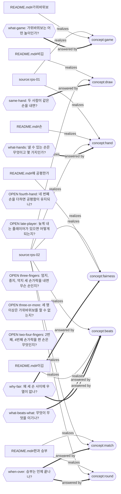

# rock-paper-scissors — the net

Rendered from `mangsang/` by `mangsang report`; the record is the source, this page is not. 7 concept(s), 15 relation(s), 13 question(s), 5 source(s).

Rounded nodes are concepts, hexagons are questions (OPEN: nothing answers it yet); a dotted edge is a relation whose end moved since it was confirmed.

## Concepts

### beats

> 손 사이의 이김 관계. 가위는 보를, 바위는 가위를, 보는 바위를 이기며 순환한다 — 각 손은 하나를 이기고 하나에게 진다.

- `source:rps-02` realizes — fresh · “이김 관계(순환)”
- `README.md#이김` realizes — fresh · “이김은 순환한다: 가위는 보를 이기고, 바위는 가위를 이기고, 보는 바위를 이긴다.”

### draw

> 두 사람이 같은 손을 낸 판. 승부가 나지 않아 다시 내고, 승부에 세지 않는다.

- `README.md#비김` realizes — fresh · “두 사람이 같은 손을 내면 비긴다.”
- `source:rps-02` realizes — fresh · “비김”

### fairness

> 어느 손을 내도 이길 확률과 질 확률이 같다는 성질. 손의 수가 아니라 이김이 순환한다는 데서 온다.

- `source:rps-02` realizes — fresh · “왜 세 손이 공평한가(순환이라 우열이 없다)”
- `README.md#왜 공평한가` realizes — fresh · “공평함은 손의 수가 아니라 이김이 순환한다는 데서 온다.”

### game

> 가위바위보: 두 사람이 동시에 손 하나를 내고, 정해진 이김 관계로 승부를 가리는 놀이.

- `source:rps-01` realizes — fresh · “가위바위보에 대해 설명하고”
- `README.md#가위바위보` realizes — fresh · “두 사람이 동시에 손 모양 하나를 내고, 정해진 이김 관계로 승부를 가리는 놀이다.”

### hand

> 가위바위보에서 한 사람이 한 판에 내는 것. 가위, 바위, 보 셋뿐이고 그 밖의 것은 무효다.

- `source:rps-01` realizes — fresh · “가위바위보에 대해 설명하고”
- `README.md#손` realizes — fresh · “손은 셋이다: 가위, 바위, 보.”
- `source:rps-02` realizes — fresh · “손(가위·바위·보)”

### match

> 승부가 끝나는 방식. 단판은 비기지 않은 첫 판의 승자가, 삼세판은 먼저 두 판을 이긴 쪽이 이긴다.

- `README.md#판과 승부` realizes — fresh · “삼세판이면 먼저 두 판을 이긴 쪽이 이긴다.”
- `source:rps-02` realizes — fresh · “승부 방식(단판/삼세판)”

### round

> 두 사람이 손을 한 번씩 내는 단위.

- `README.md#판과 승부` realizes — fresh · “판은 두 사람이 손을 한 번씩 내는 단위다.”
- `source:rps-02` realizes — fresh · “판”

## Questions

- **fourth-hand** 네 번째 손을 더하면 공평함이 유지되나? — OPEN
- **grounded** 모든 개념이 누군가 한 말과 글 양쪽에 근거하는가? — invariant (`check`)
- **late-player** 늦게 내는 플레이어가 있으면 어떻게 되는지? — OPEN
- **same-hand** 두 사람이 같은 손을 내면? — answered; answered by draw
- **sections-owned** 글의 모든 절이 어떤 개념의 투영인가? — invariant (`check`)
- **three-fingers** 엄지, 중지, 약지 세 손가락을 내면 무슨 손인지? — OPEN
- **three-or-more** 세 명 이상은 가위바위보를 할 수 없는지? — OPEN
- **two-four-fingers** 2번째, 4번째 손가락을 편 손은 무엇인지? — OPEN
- **what-beats-what** 무엇이 무엇을 이기나? — answered; answered by beats
- **what-game** 가위바위보는 어떤 놀이인가? — answered; answered by game
- **what-hands** 낼 수 있는 손은 무엇이고 몇 가지인가? — answered; answered by hand
- **when-over** 승부는 언제 끝나나? — answered; answered by round, match
- **why-fair** 왜 세 손 사이에 우열이 없나? — answered; answered by fairness, beats

## Sources

### rps-01 — guineeeeeeeeeeeeeeeeeeeeeeeerm (Claude Code session d70eaef1-8a25-4059-9853-68c3c9af45e1, 2026-09-24 (KST evening))

> - 첫 프로젝트로는 가위바위보에 대해 설명하고 이를 머메이드로 보는 것.

### rps-02 — Claude (claude-fable-5-1) (the same session, the proposal's section on the scenario), replying to rps-01

> - **개념**: 손(가위·바위·보), 이김 관계(순환), 비김, 판, 승부 방식(단판/삼세판).
> - **질문(CQ)**: "무엇이 무엇을 이기나?", "같은 손이면?", "왜 세 손이 공평한가(순환이라 우열이 없다)?", "승부는 언제 끝나나?" 등.

### rps-03 — guineeeeeeeeeeeeeeeeeeeeeeeerm (the same session), replying to rps-02

> 좋아 그렇게 가자

### rps-04 — guineeeeeeeeeeeeeeeeeeeeeeeerm (the same session, after the skeleton was explained)

> 다음의 질문을 더하고 싶어.
> - 세 명 이상은 가위바위보를 할 수 없는지?
> - 엄지, 중지, 약지 세 손가락을 내면 무슨 손인지?
> - 늦게 내는 플레이어가 있으면 어떻게 되는지?

### rps-05 — guineeeeeeeeeeeeeeeeeeeeeeeerm (the same session)

> 2번째, 4번째 손가락을 편 손은 무엇인지?
