# rock-paper-scissors — the net

Rendered from `mangsang/` by mangsang 1.6.0; the record is the source, this page is not. 10 concept(s), 27 relation(s), 18 question(s), 12 source(s).

```mermaid
flowchart LR
  n409300dd["README.md#35;가위바위보"]
  n1715cbdf["README.md#35;동시"]
  n5967b240["README.md#35;무효"]
  n903f5380["README.md#35;비김"]
  n20272887["README.md#35;손"]
  n5a003516["README.md#35;여럿이 할 때"]
  n03a8a3a0["README.md#35;왜 공평한가"]
  nd86c68d9["README.md#35;이김"]
  n84fab4bc["README.md#35;판과 승부"]
  n795ca2b2(["concept:beats"])
  n5e204df2(["concept:draw"])
  n0e453a44(["concept:elimination"])
  n9acb601e(["concept:fairness"])
  n98006228(["concept:game"])
  n90ecb089(["concept:hand"])
  n2758c11c(["concept:match"])
  n75345a2f(["concept:round"])
  n692181ff(["concept:simultaneity"])
  ne737dac4(["concept:void"])
  n903f5380 -->|"realizes"| n5e204df2
  n84fab4bc -->|"realizes"| n2758c11c
  n5a003516 -->|"realizes"| n98006228
  n03a8a3a0 -->|"realizes"| n9acb601e
  n409300dd -->|"realizes"| n98006228
  n20272887 -->|"realizes"| n90ecb089
  n5a003516 -->|"realizes"| n0e453a44
  n84fab4bc -->|"realizes"| n75345a2f
  n20272887 -->|"realizes"| ne737dac4
  nd86c68d9 -->|"realizes"| n795ca2b2
  n5967b240 -->|"realizes"| ne737dac4
  n1715cbdf -->|"realizes"| n692181ff
  n5cc0e005{{"fourth-hand: 네 번째 손을 더하면 공평함이 유지되나?"}}
  n5cc0e005 ==>|"answered by"| n90ecb089
  nd7f35967{{"late-player: 늦게 내는 플레이어가 있으면 어떻게 되는지?"}}
  nd7f35967 ==>|"answered by"| n692181ff
  nd7f35967 ==>|"answered by"| ne737dac4
  n88bd51d0{{"many-best-of: 세 명 이상일 때도 삼세판을 하나?"}}
  n88bd51d0 ==>|"answered by"| n2758c11c
  nd666488e{{"many-winner: 여럿이 할 때 승자는 어떻게 가리나?"}}
  nd666488e ==>|"answered by"| n0e453a44
  nc2627583{{"same-hand: 두 사람이 같은 손을 내면?"}}
  nc2627583 ==>|"answered by"| n5e204df2
  n9db3d9cf{{"three-fingers: 엄지, 중지, 약지 세 손가락을 내면 무슨 손인지?"}}
  n9db3d9cf ==>|"answered by"| n90ecb089
  n0caecec2{{"three-or-more: 세 명 이상은 가위바위보를 할 수 없는지?"}}
  n0caecec2 ==>|"answered by"| n98006228
  n0caecec2 ==>|"answered by"| n0e453a44
  n47d245c6{{"thumb-index: 엄지, 검지를 편 손은 무효인가?"}}
  n47d245c6 ==>|"answered by"| n90ecb089
  n36ace197{{"two-four-fingers: 2번째, 4번째 손가락을 편 손은 무엇인지?"}}
  n36ace197 ==>|"answered by"| n90ecb089
  n8462af07{{"void-round: 무효인 판은 어떻게 다루나?"}}
  n8462af07 ==>|"answered by"| ne737dac4
  na08501d4{{"what-beats-what: 무엇이 무엇을 이기나?"}}
  na08501d4 ==>|"answered by"| n795ca2b2
  n72ff044d{{"what-game: 가위바위보는 어떤 놀이인가?"}}
  n72ff044d ==>|"answered by"| n98006228
  na02614e2{{"what-hands: 낼 수 있는 손은 무엇이고 몇 가지인가?"}}
  na02614e2 ==>|"answered by"| n90ecb089
  nf32fea97{{"what-simultaneous: 동시에 냈다는 것은 무슨 뜻인가?"}}
  nf32fea97 ==>|"answered by"| n692181ff
  n591e7cd9{{"when-over: 승부는 언제 끝나나?"}}
  n591e7cd9 ==>|"answered by"| n75345a2f
  n591e7cd9 ==>|"answered by"| n2758c11c
  n321d87c5{{"why-fair: 왜 세 손 사이에 우열이 없나?"}}
  n321d87c5 ==>|"answered by"| n9acb601e
  n321d87c5 ==>|"answered by"| n795ca2b2
```

Rounded nodes are concepts, hexagons are questions (OPEN: nothing answers it yet); a dotted edge is a relation whose end moved since it was confirmed. Sources are not drawn; each concept lists the words that ground it below.

## Concepts

### beats

> 손 사이의 이김 관계. 가위는 보를, 바위는 가위를, 보는 바위를 이기며 순환한다 — 각 손은 하나를 이기고 하나에게 진다.

declared by guineeeeeeeeeeeeeeeeeeeeeeeerm (approved in `source:rps-03`)

- `source:rps-02` realizes — fresh · delegated: the sections quote the concepts they explain; the owner approved the concept … · “이김 관계(순환)”
- `README.md#이김` realizes — fresh · delegated: the sections quote the concepts they explain; the owner approved the concept … · “이김은 순환한다: 가위는 보를 이기고, 바위는 가위를 이기고, 보는 바위를 이긴다.”

### draw

> 낸 손의 분류가 둘로 나뉘지 않은 판 — 모두 같은 손이거나 세 손이 다 나온 경우. 승부가 나지 않아 다시 내고, 승부에 세지 않는다.

declared by guineeeeeeeeeeeeeeeeeeeeeeeerm (approved in `source:rps-12`)

- `README.md#비김` realizes — fresh · delegated: the concepts' meanings were widened from two players to any number (rps-12); … · “두 사람이 같은 손을 내면 비긴다.”
- `source:rps-02` realizes — fresh · delegated: the concepts' meanings were widened from two players to any number (rps-12); … · “비김”
- `source:rps-12` realizes — fresh · delegated: the sections and the concepts are the owner's words from rps-12 (technical, d… · “손의 분류가 둘로 나뉘는 경우에만 승부가 난 것으로 보고”

### elimination

> 여럿이 할 때 승자를 가리는 방식: 모든 플레이어가 동시에 낸 손의 분류가 둘로 나뉘는 경우에만 승부가 난 것으로 보고, 승리한 집단끼리 다시 승부를 이어 나가기를 반복하며, 승리한 집단에 한 명이 남았을 때 판의 승자가 나온 것으로 친다. 두 명 승부도 이 규칙의 경우다.

declared by guineeeeeeeeeeeeeeeeeeeeeeeerm (approved in `source:rps-12`)

- `README.md#여럿이 할 때` realizes — fresh · delegated: the sections and the concepts are the owner's words from rps-12 (technical, d… · “승리한 집단에 한 명이 남았을 때 판의 승자가 나온 것으로 친다.”
- `source:rps-12` realizes — fresh · delegated: the sections and the concepts are the owner's words from rps-12 (technical, d… · “승리한 집단끼리 다시 승부를 이어나가는 것을 반복해야함”

### fairness

> 어느 손을 내도 이길 확률과 질 확률이 같다는 성질. 손의 수가 아니라 이김이 순환한다는 데서 온다.

declared by guineeeeeeeeeeeeeeeeeeeeeeeerm (approved in `source:rps-03`)

- `source:rps-02` realizes — fresh · delegated: the sections quote the concepts they explain; the owner approved the concept … · “왜 세 손이 공평한가(순환이라 우열이 없다)”
- `README.md#왜 공평한가` realizes — fresh · delegated: a section was appended after them: the title section spans the whole file and… · “공평함은 손의 수가 아니라 이김이 순환한다는 데서 온다.”

### game

> 두 명 이상이 동시에 손 하나씩 내고, 정해진 이김 관계로 승부를 가리는 놀이.

declared by guineeeeeeeeeeeeeeeeeeeeeeeerm (approved in `source:rps-12`)

- `README.md#여럿이 할 때` realizes — fresh · delegated: the sections and the concepts are the owner's words from rps-12 (technical, d… · “가위바위보는 두 명 이상이면 할 수 있다.”
- `source:rps-01` realizes — fresh · delegated: the concepts' meanings were widened from two players to any number (rps-12); … · “가위바위보에 대해 설명하고”
- `README.md#가위바위보` realizes — fresh · delegated: mangsang 1.6.0 cuts the title heading's section at the next heading instead o… · re-confirmed 1 time(s) · “두 명 이상이 동시에 손 모양 하나씩 내고, 정해진 이김 관계로 승부를 가리는 놀이다.”
- `source:rps-12` realizes — fresh · delegated: the sections and the concepts are the owner's words from rps-12 (technical, d… · “가위바위보는 두명 이상이면 플레이 가능”

### hand

> 가위바위보에서 한 사람이 한 판에 내는 것. 가위, 바위, 보 셋뿐이고, 세 손 밖의 것을 내면 그 판은 무효인 판이 된다.

declared by guineeeeeeeeeeeeeeeeeeeeeeeerm (approved in `source:rps-10`)

- `source:rps-01` realizes — fresh · delegated: hand's meaning was revised to name the void round (rps-10); every quoted sent… · “가위바위보에 대해 설명하고”
- `README.md#손` realizes — fresh · delegated: hand's meaning was revised to name the void round (rps-10); every quoted sent… · “손은 셋이다: 가위, 바위, 보.”
- `source:rps-02` realizes — fresh · delegated: hand's meaning was revised to name the void round (rps-10); every quoted sent… · “손(가위·바위·보)”

### match

> 승부가 끝나는 방식. 단판은 비기지 않은 첫 판의 승자가, 삼세판은 먼저 두 판을 이긴 쪽이 이긴다. 세 명 이상일 때는 보통 한 판으로 승부를 낸다.

declared by guineeeeeeeeeeeeeeeeeeeeeeeerm (approved in `source:rps-12`)

- `README.md#판과 승부` realizes — fresh · delegated: the concepts' meanings were widened from two players to any number (rps-12); … · “삼세판이면 먼저 두 판을 이긴 쪽이 이긴다.”
- `source:rps-12` realizes — fresh · delegated: the sections and the concepts are the owner's words from rps-12 (technical, d… · “세명 이상일때는 보통 한 판으로 승부를 낸다”
- `source:rps-02` realizes — fresh · delegated: the concepts' meanings were widened from two players to any number (rps-12); … · “승부 방식(단판/삼세판)”

### round

> 모든 플레이어가 손을 한 번씩 내는 데서 시작해, 승리한 집단끼리 되풀이하여 승자 한 명이 남을 때까지 이어지는 단위.

declared by guineeeeeeeeeeeeeeeeeeeeeeeerm (approved in `source:rps-12`)

- `README.md#판과 승부` realizes — fresh · delegated: the round's sentence now covers any number of players, as the owner said in r… · “판은 모든 플레이어가 손을 한 번씩 내는 데서 시작해 승자 한 명이 남을 때까지 이어지는 단위다.”
- `source:rps-02` realizes — fresh · delegated: the concepts' meanings were widened from two players to any number (rps-12); … · “판”

### simultaneity

> 동시에 낸다는 것: '상대가 낸 손이 무엇인지 인지하기 전에 내 손을 낸다'가 모두에게 성립하는 것. 서로 상대방이 무엇을 냈는지 알지 못한 채 내야 승부가 공정하기 때문에 중요하다.

declared by guineeeeeeeeeeeeeeeeeeeeeeeerm (approved in `source:rps-07`)

- `README.md#동시` realizes — fresh · delegated: a section was appended after them; the quoted sentences stand unchanged (tech… · “'상대가 낸 손이 무엇인지 인지하기 전에 내 손을 낸다'가 모두에게 성립한다면 동시에 낸 것이다.”
- `source:rps-07` realizes — fresh · delegated: the section is the owner's own words from rps-07 (technical, delegated) · “'상대가 낸 손이 무엇인지 인지하기 전에 내 손을 낸다'가 모두에게 성립한다면 이는 '동시에' 냈다고 할 수 있어.”

### void

> 무효인 판: 판이 없었다는 것과 같은 식으로 보는 판. 동시가 성립하지 않으면 승패의 여부와 상관 없이 무효인 판이 된다.

declared by guineeeeeeeeeeeeeeeeeeeeeeeerm (approved in `source:rps-08`)

- `README.md#손` realizes — fresh · delegated: the owner approved the connection in rps-10 (technical, delegated) · “세 손 밖의 것을 내면 그 판은 무효인 판이 된다.”
- `source:rps-09` realizes — fresh · delegated: the owner approved the connection in rps-10 (technical, delegated) · “세 손 밖의 것을 내면 그 판은 무효인 판이 된다”
- `source:rps-08` realizes — fresh · delegated: the section is the owner's own words from rps-08 (technical, delegated) · “무효인 판이 된다는 것은 판이 없었다는 것과 같은 식으로 본다는 것.”
- `README.md#무효` realizes — fresh · delegated: the concepts' meanings were widened from two players to any number (rps-12); … · “동시가 성립하지 않으면 승패의 여부와 상관 없이 무효인 판이 된다.”

## Questions

- **fourth-hand** 네 번째 손을 더하면 공평함이 유지되나? — answered; answered by hand · by guineeeeeeeeeeeeeeeeeeeeeeeerm (approved in `source:rps-11`)
- **grounded** 모든 개념이 누군가 한 말과 글 양쪽에 근거하는가? — invariant (`check`) · by guineeeeeeeeeeeeeeeeeeeeeeeerm (approved in `source:rps-03`)
- **late-player** 늦게 내는 플레이어가 있으면 어떻게 되는지? — answered; answered by simultaneity, void · by guineeeeeeeeeeeeeeeeeeeeeeeerm (approved in `source:rps-08`)
- **many-best-of** 세 명 이상일 때도 삼세판을 하나? — answered; answered by match · by guineeeeeeeeeeeeeeeeeeeeeeeerm (approved in `source:rps-12`)
- **many-winner** 여럿이 할 때 승자는 어떻게 가리나? — answered; answered by elimination · by guineeeeeeeeeeeeeeeeeeeeeeeerm (approved in `source:rps-12`)
- **same-hand** 두 사람이 같은 손을 내면? — answered; answered by draw · by guineeeeeeeeeeeeeeeeeeeeeeeerm (approved in `source:rps-03`)
- **sections-owned** 글의 모든 절이 어떤 개념의 투영인가? — invariant (`check`) · by guineeeeeeeeeeeeeeeeeeeeeeeerm (approved in `source:rps-03`)
- **three-fingers** 엄지, 중지, 약지 세 손가락을 내면 무슨 손인지? — answered; answered by hand · by guineeeeeeeeeeeeeeeeeeeeeeeerm (approved in `source:rps-07`)
- **three-or-more** 세 명 이상은 가위바위보를 할 수 없는지? — answered; answered by game, elimination · by guineeeeeeeeeeeeeeeeeeeeeeeerm (approved in `source:rps-12`)
- **thumb-index** 엄지, 검지를 편 손은 무효인가? — answered; answered by hand · by guineeeeeeeeeeeeeeeeeeeeeeeerm (approved in `source:rps-07`)
- **two-four-fingers** 2번째, 4번째 손가락을 편 손은 무엇인지? — answered; answered by hand · by guineeeeeeeeeeeeeeeeeeeeeeeerm (approved in `source:rps-07`)
- **void-round** 무효인 판은 어떻게 다루나? — answered; answered by void · by guineeeeeeeeeeeeeeeeeeeeeeeerm (approved in `source:rps-08`)
- **what-beats-what** 무엇이 무엇을 이기나? — answered; answered by beats · by guineeeeeeeeeeeeeeeeeeeeeeeerm (approved in `source:rps-03`)
- **what-game** 가위바위보는 어떤 놀이인가? — answered; answered by game · by guineeeeeeeeeeeeeeeeeeeeeeeerm (approved in `source:rps-03`)
- **what-hands** 낼 수 있는 손은 무엇이고 몇 가지인가? — answered; answered by hand · by guineeeeeeeeeeeeeeeeeeeeeeeerm (approved in `source:rps-03`)
- **what-simultaneous** 동시에 냈다는 것은 무슨 뜻인가? — answered; answered by simultaneity · by guineeeeeeeeeeeeeeeeeeeeeeeerm (approved in `source:rps-07`)
- **when-over** 승부는 언제 끝나나? — answered; answered by round, match · by guineeeeeeeeeeeeeeeeeeeeeeeerm (approved in `source:rps-03`)
- **why-fair** 왜 세 손 사이에 우열이 없나? — answered; answered by fairness, beats · by guineeeeeeeeeeeeeeeeeeeeeeeerm (approved in `source:rps-03`)

## Sources

### rps-01 — guineeeeeeeeeeeeeeeeeeeeeeeerm (Claude Code session d70eaef1-8a25-4059-9853-68c3c9af45e1, 2026-09-24 (KST evening))

> - 첫 프로젝트로는 가위바위보에 대해 설명하고 이를 머메이드로 보는 것.

### rps-02 — Claude (claude-fable-5-1) (the same session, the proposal's section on the scenario), replying to rps-01

> - **개념**: 손(가위·바위·보), 이김 관계(순환), 비김, 판, 승부 방식(단판/삼세판).
> - **질문(CQ)**: "무엇이 무엇을 이기나?", "같은 손이면?", "왜 세 손이 공평한가(순환이라 우열이 없다)?", "승부는 언제 끝나나?" 등.

### rps-04 — guineeeeeeeeeeeeeeeeeeeeeeeerm (the same session, after the skeleton was explained) — grounds nothing yet

> 다음의 질문을 더하고 싶어.
> - 세 명 이상은 가위바위보를 할 수 없는지?
> - 엄지, 중지, 약지 세 손가락을 내면 무슨 손인지?
> - 늦게 내는 플레이어가 있으면 어떻게 되는지?

### rps-05 — guineeeeeeeeeeeeeeeeeeeeeeeerm (the same session) — grounds nothing yet

> 2번째, 4번째 손가락을 편 손은 무엇인지?

### rps-06 — guineeeeeeeeeeeeeeeeeeeeeeeerm (the same session) — grounds nothing yet

> 그럼 엄지, 검지도 무효야? 손 모양 판정에 대한 내용이 있어?

### rps-07 — guineeeeeeeeeeeeeeeeeeeeeeeerm (the same session)

> 아니 정의가 명확하면 괜찮아. '동시'라는 개념으로 돌아오자. 가위바위보에서 플레이어가 동시에 내는 것이 중요한 이유는 서로 상대방이 무엇을 냈는지 알지 못한 채로 내 손을 내야 승부가 공정하기 때문. 그렇기 때문에 '상대가 낸 손이 무엇인지 인지하기 전에 내 손을 낸다'가 모두에게 성립한다면 이는 '동시에' 냈다고 할 수 있어.

### rps-08 — guineeeeeeeeeeeeeeeeeeeeeeeerm (the same session)

> 동시가 성립하지 않으면 승패의 여부와 상관 없이 무효인 판이 된다. 무효인 판이 된다는 것은 판이 없었다는 것과 같은 식으로 본다는 것.

### rps-09 — Claude (claude-fable-5-1) (the same session, the agent's proposal), replying to rps-08

> `hand`의 뜻에 제가 쓴 "그 밖의 것은 무효다"가 아직 있습니다. 이제 "무효"가 오너가 정의한 개념이 됐으니, 이 문장이 그 뜻(판이 없었던 것으로 본다)을 가리키는 게 맞는지는 오너의 판단입니다. 맞다면 `hand`의 뜻과 README 「손」 절을 "세 손 밖의 것을 내면 그 판은 무효인 판이 된다"로 고쳐 `void`와 잇겠습니다.

### rps-11 — guineeeeeeeeeeeeeeeeeeeeeeeerm (the same session) — grounds nothing yet

> 아니 그게 아니라 세 손만 존재한다에 따라서 넷째 손을 더할 수 없어지지 않아?

### rps-12 — guineeeeeeeeeeeeeeeeeeeeeeeerm (the same session)

> 둘뿐이라는 것은 잘못된 설명. 가위바위보는 두명 이상이면 플레이 가능. 그리고 모든 플레이어가 동시에 손을 냈을때 손의 분류가 둘로 나뉘는 경우에만 승부가 난 것으로 보고, 승리한 집단끼리 다시 승부를 이어나가는 것을 반복해야함. 승리한 집단에 한 명이 남았을때 판의 승자가 나온 것으로 침. 이렇게 하면 2명 승부도 일반화된 규칙으로 설명 가능하다. 세명 이상일때는 보통 한 판으로 승부를 낸다. 3판 2선승제- 같은 것이 없다는 이야기.

## Approvals

Said to approve, not to describe: each grounds no relation and is cited only by declarations signed on it.

- **rps-03** — guineeeeeeeeeeeeeeeeeeeeeeeerm, replying to rps-02 (Claude (claude-fable-5-1)): “좋아 그렇게 가자” — approves `concept:beats`, `concept:fairness`, `cq:grounded`, `cq:same-hand`, `cq:sections-owned`, `cq:what-beats-what`, `cq:what-game`, `cq:what-hands`, `cq:when-over`, `cq:why-fair`
- **rps-10** — guineeeeeeeeeeeeeeeeeeeeeeeerm, replying to rps-09 (Claude (claude-fable-5-1)): “맞아. 연결.” — approves `concept:hand`
